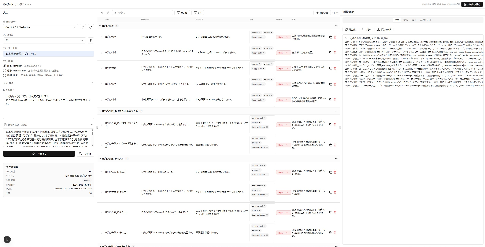

AutoTestPlaner - LLM駆動テスト設計自動化ツール
=

概要 (Overview)
--------------------------------------------------------------------------------
AutoTestcasePlanerは、ローカルLLMまたはクラウドLLMを活用して、
自然言語の操作手順・仕様書からテストケースを自動生成するWebアプリケーションです。

生成されたテストケースはIR（中間表現）形式のJSONで管理され、
インタラクティブなエディタで編集後、CSVとしてエクスポートできます。

主な特徴:
  - 自然言語入力からJSTQB準拠のテスト設計を自動生成
  - カバレッジルール（smoke / regression / full）による品質制御
  - 複数LLMプロバイダ対応（Ollama, OpenAI, Anthropic Claude, Google Gemini）
  - プロファイル機能による用語・スタイルのカスタマイズ
  - インラインセル編集・Undo/Redo・バルク操作対応のIRエディタ
  - CSV エクスポート（RFC4180準拠・UTF-8 BOM付き）
  - 全リクエスト/レスポンスの監査ログ記録

### プレビュー




技術スタック (Tech Stack)
--------------------------------------------------------------------------------

  [ Frontend ]
    - Next.js 16.1 / React 19 / TypeScript
    - Zustand (状態管理)
    - Radix UI (UIコンポーネント)
    - Tailwind CSS 3.4
    - Zod (バリデーション)

  [ Backend ]
    - Node.js / Express 4 / TypeScript
    - Prisma 5 (ORM)
    - SQLite (データベース)
    - Zod (スキーマバリデーション)
    - csv-stringify (CSV生成)
    - js-yaml (ルールエンジン)

  [ LLM連携 ]
    - Ollama (ローカルLLM: Mistral Nemo 12B / Qwen3 4B / Gemma3 4B)
    - OpenAI API (GPT-4o 等)
    - Anthropic API (Claude 等)
    - Google Gemini API

  [ インフラ / ツール ]
    - PowerShell (ローカルLLMインストーラ / 起動スクリプト)


アーキテクチャ (Architecture)
--------------------------------------------------------------------------------

```text
+-----------+       +------------+       +------------------+
|           |  API  |            |  API  |                  |
|  Frontend | ----> |  Backend   | ----> |  LLM Provider    |
|  (Next.js)|       |  (Express) |       |  (Ollama/OpenAI/ |
|  port:3000|       |  port:3001 |       |   Anthropic/     |
|           |       |            |       |   Gemini)        |
+-----------+       +-----+------+       +------------------+
                          |
                     +----+----+
                     |         |
                     | SQLite  |
                     | (Prisma)|
                     +---------+

データフロー:
  1. ユーザーが操作手順・仕様・カバレッジレベルを入力
  2. バックエンドがプロファイル・カバレッジルール(YAML)を読み込み、プロンプトを構築
  3. LLMがJSON Schema制約付きでIR（中間表現）を生成
  4. バックエンドがバリデーション・ソート・保存を実行
  5. フロントエンドのIRテーブルで表示・編集
  6. CSVとしてエクスポート
```


ディレクトリ構成 (Directory Structure)
--------------------------------------------------------------------------------

```text
AutoTestcasePlaner/
|
|-- backend/                  # バックエンド (Express + TypeScript)
|   |-- src/
|   |   |-- server.ts         # エントリポイント
|   |   |-- app/              # APIルート定義
|   |   |   |-- design.ts     # テスト設計API
|   |   |   |-- export.ts     # CSVエクスポートAPI
|   |   |   |-- ir.ts         # IR操作API
|   |   |   |-- models.ts     # モデル一覧API
|   |   |   |-- profiles.ts   # プロファイルAPI
|   |   |   |-- settings.ts   # LLM設定API
|   |   |-- lib/
|   |   |   |-- llm/
|   |   |   |   |-- registry.ts       # LLMプロバイダレジストリ
|   |   |   |   |-- prompts.ts        # プロンプトエンジニアリング
|   |   |   |   |-- settings.ts       # LLM設定管理
|   |   |   |   |-- providers/        # 各プロバイダ実装
|   |   |   |   |   |-- ollama.ts
|   |   |   |   |   |-- openai.ts
|   |   |   |   |   |-- anthropic.ts
|   |   |   |   |   |-- gemini.ts
|   |-- prisma/
|   |   |-- schema.prisma     # DBスキーマ定義
|
|-- ui/                       # フロントエンド (Next.js)
|   |-- app/
|   |   |-- layout.tsx        # ルートレイアウト
|   |   |-- page.tsx          # メインページ (3ペインエディタ)
|   |-- components/
|   |   |-- layout/           # 左ペイン（入力）/ 右ペイン（出力）
|   |   |-- ir-table/         # IRテーブル（編集可能）
|   |   |-- export/           # CSV/JSONプレビュー・品質チェック
|   |   |-- profile/          # プロファイル管理モーダル
|   |   |-- settings/         # LLM設定モーダル
|   |   |-- diff/             # 差分表示パネル
|   |-- lib/
|       |-- store.ts          # Zustand状態管理
|       |-- api.ts            # APIクライアント
|       |-- types.ts          # 型定義
|
|-- rules/                    # カバレッジルール (YAML)
|   |-- coverage_smoke.yaml
|   |-- coverage_regression.yaml
|   |-- coverage_full.yaml
|
|-- docs/                     # 設計ドキュメント
|   |-- IR_SCHEMA.json        # IR JSONスキーマ定義
|   |-- implementation_plan.md
|
|-- LocalLLM_Installer/       # Ollama + モデルインストーラ (PowerShell)
|
|-- local_starter/            # 一括起動スクリプト (Windows)
|   |-- start.bat
|   |-- start.ps1
```


工夫した点・技術的チャレンジ (Highlights)
--------------------------------------------------------------------------------

  1. マルチLLMプロバイダ対応
     - Provider Registryパターンを採用し、共通インターフェースで
       Ollama / OpenAI / Anthropic / Gemini を切り替え可能に設計
     - 各プロバイダのJSON Schema対応差異を吸収するアダプタ層を実装

  2. JSON Schema制約によるLLM出力品質の担保
     - LLMの出力をJSON Schemaで厳密に制約し、バリデーションエラー時は
       自動リトライする仕組みを実装
     - プロバイダごとのJSON出力モードの差異（OpenAI strict mode,
       Gemini responseSchema, Anthropic プロンプト指示方式）に対応

  3. YAMLベースのカバレッジルールエンジン
     - smoke / regression / full の3レベルのカバレッジルールをYAMLで定義
     - ルールをLLMプロンプトに動的注入し、テスト設計品質を制御
     - ルールのスナップショットを保存し、生成結果の再現性を確保

  4. Undo/Redo対応のIRエディタ
     - Zustandによるイミュータブルな履歴管理（最大50ステップ）
     - セル編集・行追加/削除・ケースバルク操作すべてが取り消し可能
     - LocalStorageによる自動保存でページリロード時もデータ維持

  5. 監査トレイル
     - 全LLMリクエスト/レスポンスをdesign_jobsテーブルに記録
     - IRの編集履歴をir_versionsテーブルでバージョン管理
     - 誰が編集したか（LLM / ユーザー）を追跡


環境構築 (Getting Started)
--------------------------------------------------------------------------------

  前提条件:
    - Node.js 20+
    - pnpm (フロントエンド用)
    - npm (バックエンド用)
    - Ollama（ローカルLLM使用時）

  1. リポジトリをクローン
     $ git clone <repository-url>
     $ cd AutoTestcasePlaner

  2. バックエンドのセットアップ
     $ cd backend
     $ npm install
     $ npx prisma generate
     $ npx prisma db push
     $ npm run dev

  3. フロントエンドのセットアップ（別ターミナル）
     $ cd ui
     $ pnpm install
     $ pnpm dev

  4. ブラウザでアクセス
     http://localhost:3000

  一括起動（Windows）:
     local_starter/start.bat をダブルクリックで、バックエンド・フロントエンドを同時起動

  ローカルLLMのセットアップ（任意）:
     LocalLLM_Installer/ 内のPowerShellスクリプトを実行
     - install-ollama-mistral-nemo.ps1  (推奨: 16GB RAM以上)
     - install-ollama-qwen3.ps1         (8GB RAM以上で動作)
     - install-ollama-gemma3.ps1        (8GB RAM以上で動作)


環境変数 (Environment Variables)
--------------------------------------------------------------------------------

  バックエンド（backend/.env または llm-settings.json で設定可能）:

    OPENAI_API_KEY        ... OpenAI APIキー
    ANTHROPIC_API_KEY     ... Anthropic APIキー
    GEMINI_API_KEY        ... Google Gemini APIキー
    OLLAMA_BASE_URL       ... Ollamaエンドポイント (デフォルト: http://localhost:11434)
    DATABASE_URL          ... SQLiteデータベースパス

  ※ APIキーはUI上のLLM設定モーダルからも設定可能


IR（中間表現）スキーマ (IR Schema)
--------------------------------------------------------------------------------

  {
    "suite": {
      "name": "テストスイート名",
      "coverage_level": "smoke | regression | full",
      "assumptions": ["前提条件1", "前提条件2"],
      "notes": "設計方針メモ"
    },
    "rows": [
      {
        "Case": "ケース名",
        "Step": "具体的な操作手順",
        "Expected": "期待結果",
        "Tag": "タグ1|タグ2",
        "Priority": "High | Medium | Low",
        "remarks": "根拠・観点"
      }
    ]
  }

備考
--------------------------------------------------------------------------------
これらはClaude Code,Codex,v0,ローカルLLM（gpt-oss:20b,qwen3-coder:30b）を用いて製作されています。


License
--------------------------------------------------------------------------------

  (C) 2026 All rights reserved.

  This repository is shared for portfolio and reference purposes only.
  No permission is granted to copy, modify, distribute, or use this code
  in any form without explicit written consent from the author.

  本リポジトリはポートフォリオ・参照目的でのみ公開しています。
  著作者の書面による明示的な許可なく、本コードの複製・改変・配布・使用を
  行うことはできません。

================================================================================
